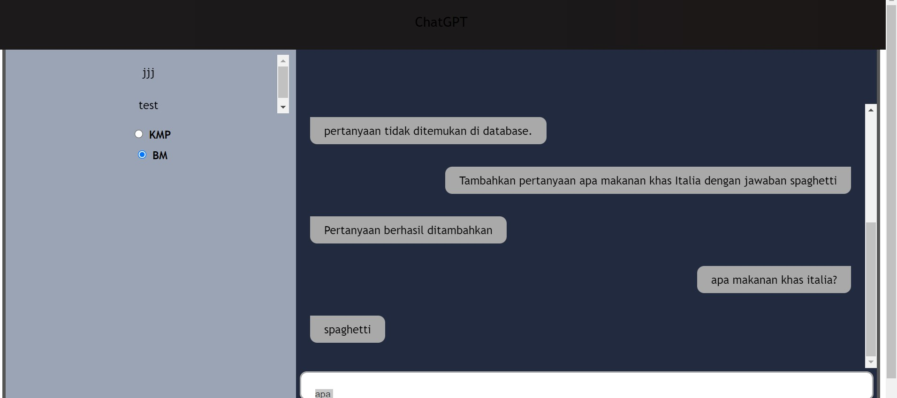

# Tubes3_13521048
> Tugas Besar III IF2211 Strategi Algoritma Semester II Tahun 2022/2023 Penerapan String Matching dan Regular Expression dalam Pembuatan ChatGPT Sederhana  
> Live demo [_here_](https://youtu.be/rWiu75sMwtU). <!-- If you have the project hosted somewhere, include the link here. -->  
> Kami juga telah mendeploy program kami, website [_here_](http://ec2-52-221-241-44.ap-southeast-1.compute.amazonaws.com:3000/).

## Table of Contents
* [General Info](#general-information)
* [Technologies Used](#technologies-used)
* [Features](#features)
* [Screenshots](#screenshots)
* [Setup](#setup)
* [Usage](#usage)
* [Project Status](#project-status)
* [Acknowledgements](#acknowledgements)
* [Author](#author)
<!-- * [License](#license) -->

## General Information
- Program ini merupakan aplikasi berbasis website ChatGPT sederhana dengan mengaplikasikan pendekatan QA KMP Pattern Search and Boyer-Moore Pattern Search.
- Implementasi berupa Pencocokan String dengan metode KMP, metode BM, klasifikasi menggunakan regex, dan aplikasi web berupa front-end dan back-end
<!-- You don't have to answer all the questions - just the ones relevant to your project. -->

## Technologies Used
Kami memakai bahasa Go-lang sebagai bahasa back-end dan bahasa Reactjs sebagai front-end, serta mysql untuk menyimpan database.

## Features
- Fitur Pertanyaan Teks 
- Fitur Kalkulator
- Fitur Tanggal
- Menambahkan pertanyaan dari jawaban ke database
- Menghapus pertanyaan dari database

## Screenshots

<!-- If you have screenshots you'd like to share, include them here. -->

## Setup
1. Install golang di komputer Anda.
2. Buka terminal dalam folder, ketik “cd src/backend”
3. Ketik “go mod vendor” yang membangun direktori bernama “vendor” di root directory modul utama.
4. Ketik “cd app”
5. Ketik “go build” untuk menjalankan program
6. Ketik “./app”

## Usage
Pengguna tinggal menambah pertanyaan yang diinginkan dengan format "Tambahkan pertanyaan xxx dengan jawaban yyy" (pastikan xxx tidak diakhiri tanda tanya). Pengguna lalu dapat bertanya mengenai pertanyaan yang sudah dimasukkan. Pengguna juga bisa bertanya hari apa di tanggal tertentu (ketik "DD/MM/YYYY") dan operasi matematika sederhana dengan operator +, -, *, /, (). Pengguna juga bisa menghapus data dengan format “Hapus
pertanyaan xxx”.

## Project Status
Project is: _complete_

## Acknowledgements

- Proyek ini dibuat untuk memenuhi tugas besar 3.
- Many thanks to: Dosen IF2211 Strategi Algoritma.

## Author
- 13521048: M Farrel Danendra Rachim
- 13521098: Fazel Ginanda
- 13521163: Zidane Firzatullah

<!-- Optional -->
<!-- ## License -->
<!-- This project is open source and available under the [... License](). -->

<!-- You don't have to include all sections - just the one's relevant to your project -->
